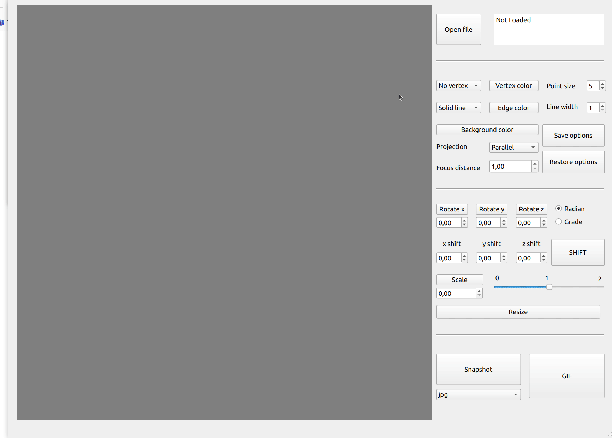

# Object_Viewer v1.0

## Что это за репозиторий?

Результат работы над своей версии программы для просмотра 3d моделей в
каркасном виде(читаемой из jbj-файла). Реализованы аффинные
преобразования(перемещение, вращение, изменение размера объекта). В программе есть
возможность перемещать, вращать объект и менять его размер(изменяются координаты
вершин объекта, а не сцены). Так же есть возможность менять настройки
отображения(толщина и цвет вершин и ребер, цвет фона). Для аффинных преобразований
есть возможность использовать как кнопки так и движения мышкой. Добавлен функционал
по созданию скриншота и gif анимации действий на сцене. Так же есть возможность
сохранить настройки отображения, который восстановятся при перезапуске программы.
Для рассчетов использовался язык Си 11 стандарта. Для графического интерфейса
использовал Qt версии 5 и QOpenGLWidget. Модуль загрузки модели и модуль аффиных
преобразований протестирован с использованием библиотеки check. Реализованы
стандартные цели для GNU программ в мейкфайле(build, test, install, uninstall, clean).

## Демонстрация

